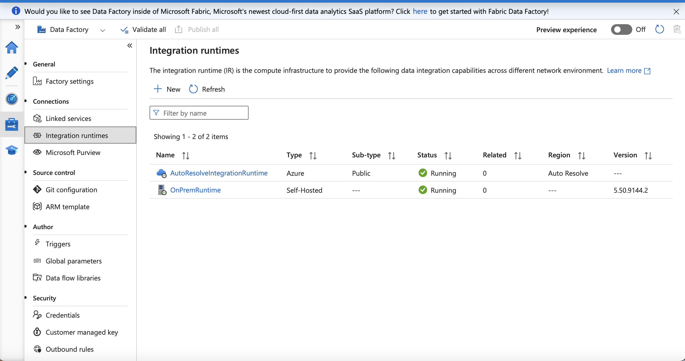
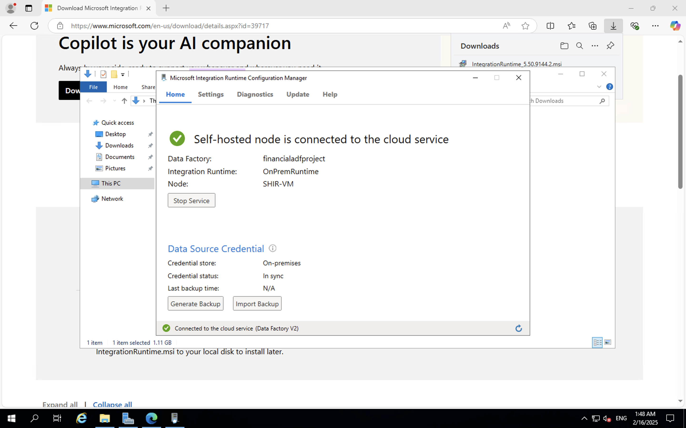

# 🟢 SHIR Status in ADF

## ✅ SHIR Status: Running and Connected
The Self-Hosted Integration Runtime (SHIR) in Azure Virtual Machine with RDP is successfully registered and connected to Azure Data Factory.

### 📸 Screenshots of Status:
- **SHIR Status in ADF:** 
- **VM RDP Connection:** 
