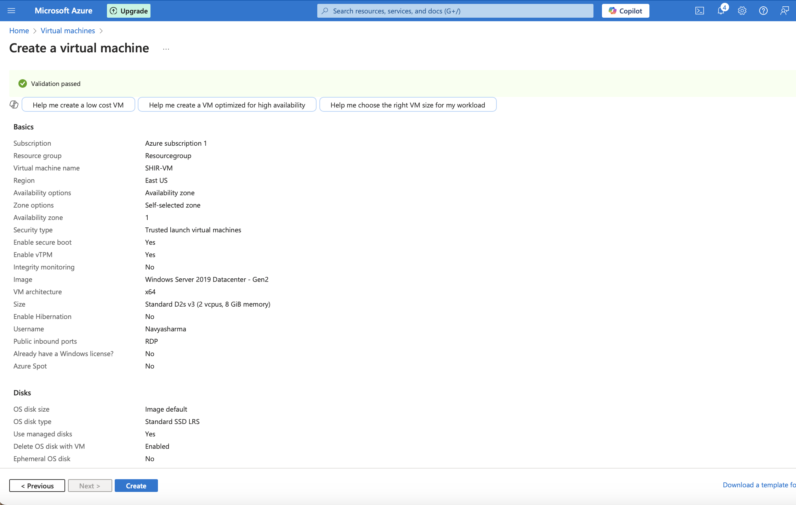
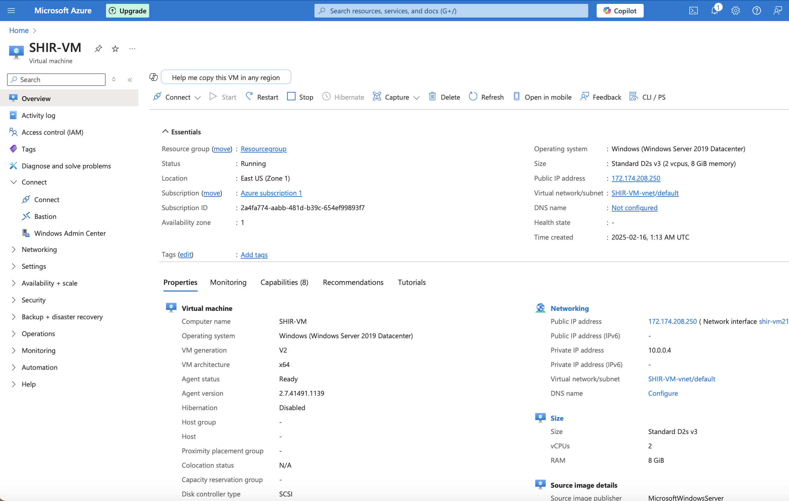

# 🚀 Virtual Machine Setup for SHIR (`SHIR-VM`)

## ✅ VM Configuration Summary
- **VM Name:** SHIR-VM  
- **Region:** East US  
- **Image:** Windows Server 2019 Datacenter - Gen2  
- **Size:** Standard_D2s_v3 (2 vCPUs, 8 GiB RAM)  
- **Public Inbound Ports:** RDP (3389)  

---

## 📸 Screenshots of VM Setup

### 1️⃣ VM Review & Create
This screenshot shows the entire VM configuration summary before deployment:

### 2️⃣ VM Running Status
This screenshot confirms that the VM is successfully deployed and online:

